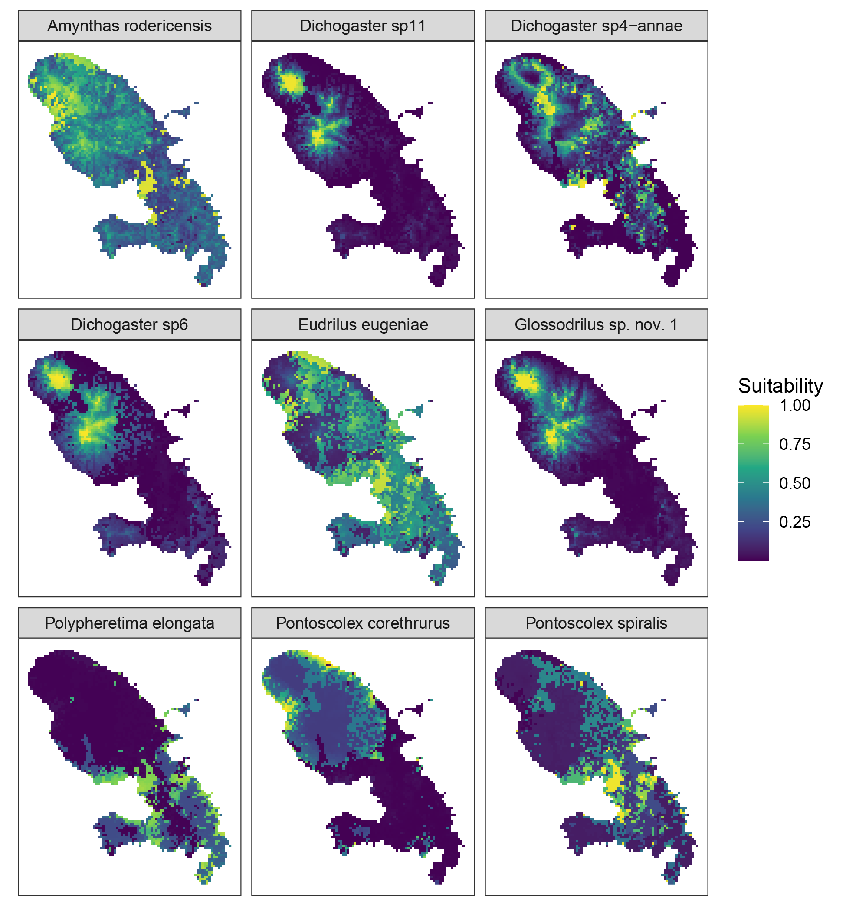
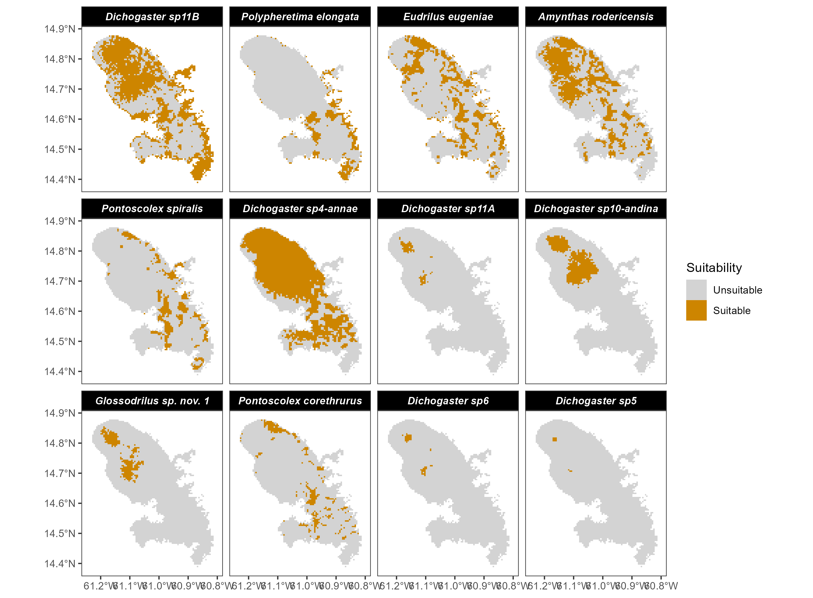
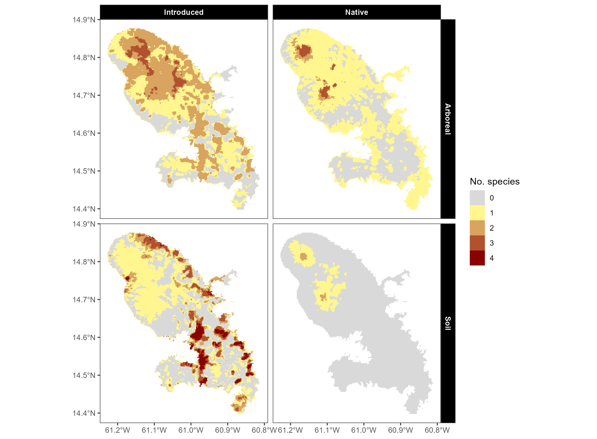
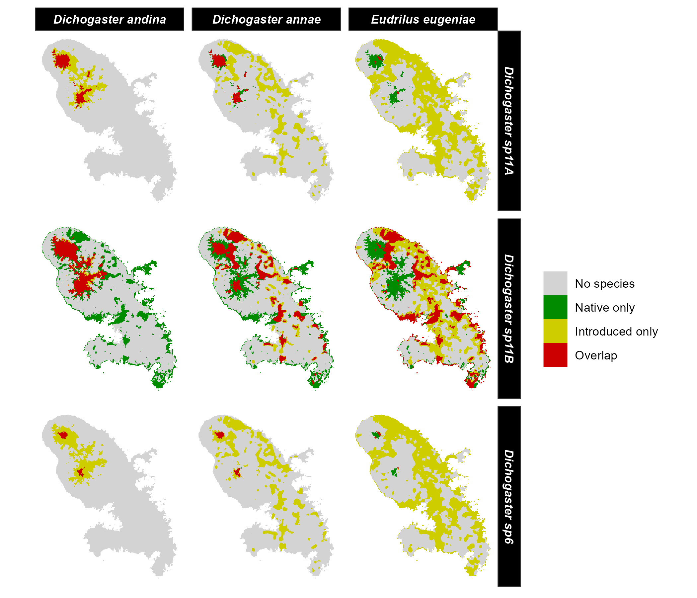
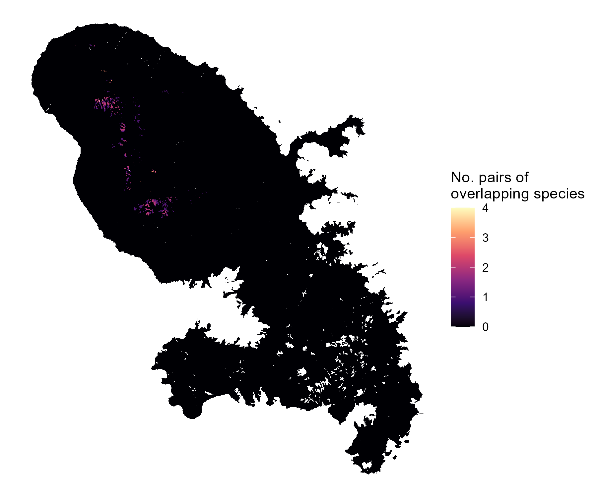
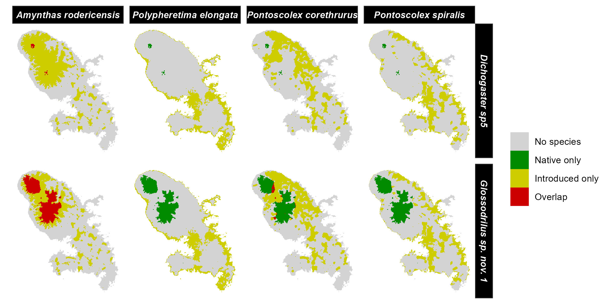

## Niche modelling of native and introduced earthworm species in the island of Martinique 

### UPDATE : 02/02/2024

Preliminary R code for generating ecological niche models / species distribution models of earthworms in Martinique, and analyzing the overlap between native and introduced species.

The models are based on ensemble projections of **five** different fine-tuned algorithms: MaxEnt, random forest, extreme gradient boosting, boosted regression trees and GLM.

Among the **12 species**, some are introduced or native, some species are arbeoreal of live in the soil. All species were modelled, even those with clearly too few occurrences.

|Species                 |Origin     |Habitat  | n.occ|
|:-----------------------|:----------|:--------|-----:|
|Dichogaster andina      |Introduced |Arboreal |     5|
|Dichogaster annae       |Introduced |Arboreal |    13|
|Eudrilus eugeniae       |Introduced |Arboreal |    36|
|Dichogaster sp11A       |Native     |Arboreal |    24|
|Dichogaster sp11B       |Native     |Arboreal |   467|
|Dichogaster sp6         |Native     |Arboreal |     6|
|Amynthas rodericensis   |Introduced |Soil     |    63|
|Polypheretima elongata  |Introduced |Soil     |    26|
|Pontoscolex corethrurus |Introduced |Soil     |    21|
|Pontoscolex spiralis    |Introduced |Soil     |    21|
|Dichogaster sp5         |Native     |Soil     |     8|
|Glossodrilus sp. nov. 1 |Native     |Soil     |    18|

The models are **NOT** final and should be considered as incorrect. A better choice of input variables and settings will be done later. In addition, the resolution has been reduced for faster computation and lower image size.

### Maps of environmental suitability

Ecological niche models produce continuous prediction of environmental suitability. 

These predictions can be converted into binary maps (suitable / unsuitable), which is necessary to delineate regions of overlap. Here the suitability threshold was set as the 10th percentile training presence threshold (i.e. omits all regions with habitat suitability lower than the suitability values for the lowest 10% of occurrence records).

Merging predictions allows to map potential species richness of native and introduced species, in both habitat types. 

### Overlap between native and introduced species
#### Maps

Here the regions of (potential) overlap are shown in red.

##### Arboreal species

A possible way to synthesize the risk posed by introduced / invasive species is to sum all these red areas in a single map.

##### Soil species

#### Overlap indices

Indices of niche overlap, based on Shoener's D index, can be computed between native and introduced species, both in the environmental space (*A*; overlap in their ecological niches) and in the geographical space (*B*; overlap in their predicted range in Martinique).

