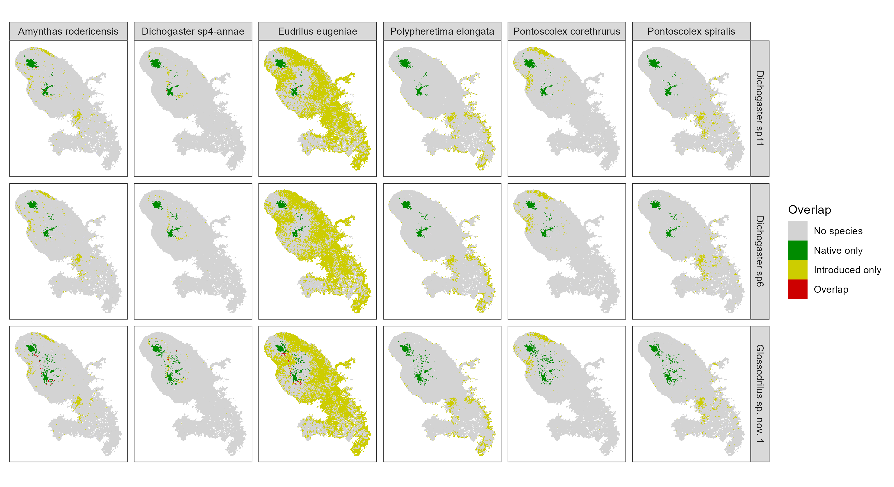

## Niche modelling of native and introduced earthworm species in the island of Martinique 

Preliminary R code for generating ecological niche models / species distribution models of earthworms in Martinique, and analyzing the overlap between native and introduced species.

The models are based on ensemble projections of four different fine-tuned algorithms: MaxEnt, but also random forest, boosted regression trees and a simple GLM.

### Maps of environmental suitability

Ecological niche models produce continuous prediction of suitability for all nine species.

The models are *NOT* final and should be considered as incorrect. A better choice of input variables and settings will be done later. 

### Overlap between native and introduced species
#### Maps

It is possible to plot the overlap between native and introduced species after defining a threshold for converting continuous suitability maps into maps of predicted presence/absence.

Here the regions of (potential) overlap are shown in red.

{width=50%}

A possible way to synthesize the risk posed by introduced / invasive species is to sum all these red areas in a single map.

{width=50%}

#### Overlap indices

Indices of niche overlap, based on Shoener's D index, can be computed between native and introduced species, both in the environmental space (overlap in their ecological niches) and in the geographical space (overlap in their predicted range in Martinique).

{width=50%}

