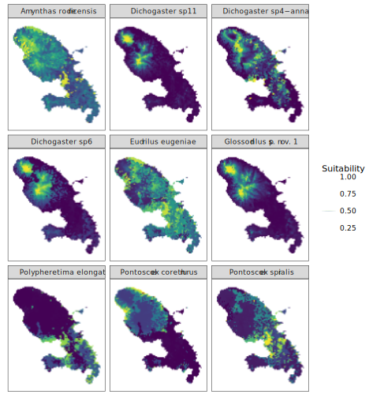

## Niche modelling of native and introduced earthworm species in the island of Martinique 

Preliminary R code for generating ecological niche models / species distribution models of earthworms in Martinique, and analyse the overlap between native and introduced species.

### Maps of environmental suitability

Continuous prediction of suitability for all nine species.

